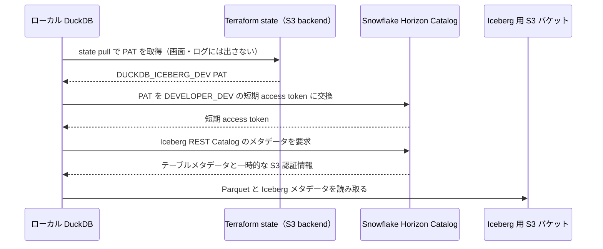

# Iceberg 用 S3 と external volume 設計

## 目的と前提

- dbt が作成する一部の Gold モデルを Snowflake 管理の Iceberg テーブルにし、データと Iceberg メタデータを自社 AWS アカウントの S3 に保存する。
- ローカルの DuckDB は Snowflake Horizon Catalog の Iceberg REST API からテーブルを発見し、一時的なストレージ認証情報で読み取る。S3 の長期アクセスキーは配布しない。
- Snowflake アカウントのリージョンは `AWS_AP_NORTHEAST_1`、既存の AWS provider は `ap-northeast-1`。S3 も東京リージョンに作る。
- Snowflake の `DEV` と `PRD` は同じアカウント内の別データベース。Iceberg 用 AWS Terraform と Snowflake Terraform は、それぞれ `dev` / `prd` workspace を使う。AWS 側と Snowflake 側は別 state。
- 2026-09-22 時点の設計。対象 provider は `snowflakedb/snowflake` 2.21 系。

## まず全体像

Iceberg テーブルは Snowflake 上で作成・管理するが、実際のデータとメタデータは AWS の S3 に保存する。その接続のために、AWS 側と Snowflake 側で次を用意する。

| 用意するもの | 何のために必要か |
| --- | --- |
| AWS の Iceberg 用 S3 バケット | テーブルのデータとメタデータを保存する場所。dev と prd で別バケットにする。 |
| AWS の IAM ロール | Snowflake が対応するバケットの `tables/` 配下を読み書きするための権限。 |
| Snowflake の external volume | S3 の保存先と AWS IAM ロールを Snowflake に教える接続設定。dev は `ICEBERG_DEV`、prd は `ICEBERG_PRD`。 |
| dbt 実行ロールへの volume の `USAGE` | dbt がその external volume を使って Iceberg テーブルを作成できるようにする。 |
| `GOLD` スキーマの既定設定 | Iceberg テーブルが使う volume を指定し、他エンジンでも読みやすい `COMPATIBLE` 形式で書き込む。 |

処理の流れは「dbt の対象モデル → Snowflake の Iceberg テーブル → external volume → AWS IAM ロール → S3」。dbt は Iceberg にしたいモデルだけ `materialized='table'` と `table_format='iceberg'` を指定する。`GOLD` スキーマに volume を設定しても、既存の view や通常の table が自動で Iceberg に変わるわけではない。外部ストレージを確実に使うため、モデル側でも対応する `ICEBERG_DEV` / `ICEBERG_PRD` を明示する。

現在構築済みなのは dev の AWS・Snowflake リソースだけ。prd は Terraform に定義済みだが、まだ apply していない。外部 volume の S3 読み書き検証と、dbt モデルの実行もこれから行う。

## 構成

| 環境 | S3 バケット | 保存先 | AWS IAM ロール | Snowflake external volume |
| --- | --- | --- | --- | --- |
| dev | `kohta-snowflake-iceberg-dev` | `s3://kohta-snowflake-iceberg-dev/tables/` | `snowflake-iceberg-dev` | `ICEBERG_DEV` |
| prd | `kohta-snowflake-iceberg-prd` | `s3://kohta-snowflake-iceberg-prd/tables/` | `snowflake-iceberg-prd` | `ICEBERG_PRD` |

バケット名は環境名で分ける。dbt 成果物用バケットも環境ごとに分離する。各環境の volume は、その環境に属する複数の Iceberg テーブルで共有する。テーブルごとの `BASE_LOCATION` は dbt が既定で `_dbt/<schema>/<model>` の形に設定するため、通常はモデル側で変更しない。

## AWS 側

Iceberg 用 S3・IAM と dbt 成果物用 S3・IAM は `terraform/aws` の同じ Terraform ルートで管理する。AWS backend は `workspace_key_prefix = "aws"`、`key = "tfstate"` とし、state は `aws/dev/tfstate` と `aws/prd/tfstate` に置く。Snowflake backend は `snowflake/dev/tfstate` と `snowflake/prd/tfstate` に置く。

backend を利用する IAM principal には、上記の state と `.tflock` オブジェクトに対する必要な S3 権限が要る。既存 backend のポリシーが旧 state key に限定されている場合は、新しい `aws/<workspace>/tfstate` と `snowflake/<workspace>/tfstate` を許可する。

### dbt artifacts AWS ルートの環境分離

`terraform/aws` は `workspace_key_prefix = "aws"` を使い、`dev` と `prd` の state を分ける。`default` workspace は plan/apply の事前条件で拒否する。dbt artifacts のバケットも環境ごとに分け、S3 prefix だけに依存した環境分離をやめる。

| workspace | S3 バケット | IAM |
| --- | --- | --- |
| `dev` | `kohta-dbt-snowflake-artifacts-dev` | ローカル実行用 `dbt-snowflake-artifacts-dev` IAM User。バケット全体の読み書き。 |
| `prd` | `kohta-dbt-snowflake-artifacts-prd` | Prefect Cloud 用 `dbt-snowflake-artifacts-prefect-prd` IAM Role（バケット全体の読み書き）と、CI 用 `dbt-snowflake-artifacts-ci-prd` IAM Role（`manifest/*` の読取のみ）。 |

各バケットには公開ブロック、SSE-S3、バージョニング、および `cache/` だけを対象にした 30 日のライフサイクルを設定する。Prefect Cloud の OIDC provider は AWS アカウント内で URL が一意になるため `prd` workspace だけが管理する。GitHub Actions OIDC provider と backend バケットは Terraform 管理外の既存リソースとして data/ backend で参照する。

旧 `default` state の共有バケットと IAM リソースは 2026-09-22 に削除済み。旧バケットはバージョニングが有効だったため、通常の `destroy` は `BucketNotEmpty` で停止した。残存したバケットに一時的に `force_destroy=true` を適用して全オブジェクトバージョンと delete marker を削除し、再度 `destroy` して完了した。一時設定は Terraform コードから撤去済み。

`terraform/aws` の `dev` workspace は 2026-09-22 に apply 済み。同日、2つの dev バケットをアカウント ID のない名前へ置き換え済み。次は `prd` workspace の plan / apply と、出力された CI Role ARN・Prefect Role ARN・S3 バケット名の dbt/Prefect 側への設定を進める。

各 workspace で次を管理する。`default` での plan・apply は事前条件で失敗させる。

- 専用 S3 バケット。パブリックアクセスを全面ブロックし、SSE-S3 暗号化とバージョニングを有効にする。
- バケットと external volume には Terraform の `prevent_destroy` を設定し、設定値の欠落や意図しない置換による削除を防ぐ。
- 現行データやメタデータを対象とする自動削除ルールは設定しない。保持期間は実データ量と Snowflake のスナップショット運用を確認してから決める。
- 環境専用 IAM ロール。`tables/` 配下に限って `GetObject`、`GetObjectVersion`、`PutObject`、`DeleteObject`、`DeleteObjectVersion` を許可する。バケットに対する `ListBucket` は当該 prefix に限定する。`GetBucketLocation` はバケット ARN に許可する。
- ロール信頼ポリシーは Snowflake アカウントの IAM ユーザー ARN と、その volume 専用の external ID の組み合わせに限定する。dev と prd でロール、external ID、保存先を共有しない。

external ID は AWS アカウント ID と環境名から `uuidv5` で固定生成する。これは認証用の秘密値ではなく、IAM ロールの principal 制限と組み合わせて使う。選択中の workspace の生成値は `terraform output iceberg_external_id` で確認できる。

Snowflake 管理の Iceberg テーブルは書き込みを行うため、volume の `ALLOW_WRITES` は `TRUE` とする。DuckDB 用に AWS IAM ユーザーや固定アクセスキーは作らない。

## Snowflake 側

`terraform/snowflake` で workspace ごとに次を管理する。

- `snowflake_external_volume` を 1 件。`STORAGE_PROVIDER = S3`、`STORAGE_BASE_URL` は上表の `tables/`、`STORAGE_AWS_ROLE_ARN` は対応する IAM ロール、`STORAGE_AWS_EXTERNAL_ID` は環境専用の固定値を指定する。
- volume は SYSADMIN 所有とする。初回のみ `ACCOUNTADMIN` から `SYSADMIN` に `CREATE EXTERNAL VOLUME` アカウント権限を付与する。通常の Terraform 実行で `ACCOUNTADMIN` は使わない。
- dbt 実行ロール `ADMINISTRATOR_DEV` / `ADMINISTRATOR_PRD` に対応する volume の `USAGE` を付与する。Iceberg テーブルの所有ロールは `USAGE` を維持する。
- 読取用 database role `READ_DEV` / `READ_PRD` に、Gold スキーマ内の既存・将来の Iceberg table に対する `SELECT` を付与する。Iceberg table は通常の `TABLES` と別の object type のため、専用の grant が必要。`DEVELOPER_<ENV>`、`ANALYST_<ENV>`、`LIGHTDASH_<ENV>` はこの role を継承する。
- `GOLD` スキーマに `EXTERNAL_VOLUME = ICEBERG_<ENV>` と `STORAGE_SERIALIZATION_POLICY = COMPATIBLE` を設定する。後者は DuckDB など他エンジンとの互換性を確保するため、最初の Iceberg テーブル作成前に設定する。テーブル作成後に当該テーブルの serialization policy は変更できない。
- Gold 内でも dbt で Iceberg と明示したモデルだけをテーブル化する。既存の view モデルは段階的に切り替える。

Snowflake Terraform は選択中の `dev` / `prd` workspace と AWS caller identity から、対応する Iceberg バケット名、IAM ロール ARN、固定 external ID を自動的に組み立てる。AWS と Snowflake の Terraform 実行には同じ AWS アカウントの認証情報を使う。`default` workspace では volume と Gold の既定値を作成・変更しない。AWS state 全体には dev 用アクセスキーが含まれるため、Snowflake 側から remote state を読み取らない。

DuckDB の参照ロールは Gold のデータベース・スキーマ `USAGE` と対象 Iceberg テーブル `SELECT` に絞る。DuckDB は Horizon Catalog に認証し、credential vending を使う。DuckDB に external volume の `USAGE` や S3 IAM ロールは付与しない。

### ローカル DuckDB から読み取る仕組み

ローカルの DuckDB は S3 に直接ログインしない。`scripts/test.py` が Terraform state から PAT をプロセス内だけで取得し、Snowflake Horizon Catalog から短時間だけ有効な認証情報を受け取って Iceberg テーブルを読む。

#### Horizon Catalog とは

Horizon Catalog は、Snowflake が提供する外部エンジン向けの Iceberg REST Catalog である。DuckDB などが Snowflake 管理 Iceberg テーブルを読むときの窓口になり、テーブルの発見、Snowflake 権限の確認、一時的な S3 認証情報の発行を担う。

Horizon Catalog 自体は、既存の Snowflake アカウントで提供されるマネージド機能であり、今回 Terraform で `CREATE` する個別の Snowflake オブジェクトではない。接続先はアカウント識別子から決まる Horizon Iceberg REST Catalog のエンドポイントで、DuckDB のスクリプト側で指定する。

Terraform では Horizon Catalog そのものではなく、Catalog 経由のアクセスに必要な周辺設定を管理する。

| Terraform で管理するもの | Horizon Catalog との関係 |
| --- | --- |
| Snowflake 管理 Iceberg table と `external volume` | Catalog が公開するテーブルと、その S3 保存先を定義する。 |
| `DEVELOPER_DEV` と `READ_DEV` の権限 | Catalog が DuckDB の読み取りを認可する根拠になる。 |
| DuckDB 用 PAT | Catalog への認証と短期 access token の取得に使う。 |
| AWS の S3・IAM ロール | Snowflake が external volume 経由でデータを保存し、Catalog が短期 S3 認証情報を発行する基盤になる。 |

したがって、Horizon Catalog 用の Terraform resource を追加する必要はない。DuckDB がどの Catalog URL に接続するかは、Terraform ではなく `scripts/test.py` のクライアント設定として管理する。

`external volume` と Horizon Catalog は用途が異なる。

| 設定 | 主な利用者 | 役割 |
| --- | --- | --- |
| external volume | Snowflake | Iceberg テーブルのデータ・メタデータを S3 に保存する場所と、Snowflake が S3 を操作する IAM ロールを定義する。 |
| Horizon Catalog | DuckDB などの外部エンジン | Snowflake 管理の Iceberg テーブルを発見させ、Snowflake の権限で認可し、S3 読取り用の短期認証情報を渡す API を提供する。 |

つまり DuckDB は external volume を直接利用せず、Horizon Catalog の Iceberg REST API に接続する。Horizon Catalog が確認した Snowflake のテーブル権限に基づき、必要な範囲・期間に限った S3 認証情報を DuckDB に返す。



読み取り時の責務は次のように分かれる。

| 段階 | 実行すること | 認可する主体 |
| --- | --- | --- |
| 1. PAT の取得 | スクリプトが `terraform state pull` を実行し、state 内の PAT をメモリ上で読む | state backend への AWS 読取権限 |
| 2. Snowflake へのログイン | PAT を `DEVELOPER_DEV` に限定した短期 access token に交換する | Snowflake の認証ポリシー・ネットワークポリシー |
| 3. テーブルの発見 | DuckDB が Horizon の Iceberg REST Catalog に `DEV` catalog を attach する | `DEV` database / `GOLD` schema の `USAGE` と Iceberg table の `SELECT` |
| 4. ファイルの読取り | Horizon が返した一時的な S3 認証情報を DuckDB が使用する | Snowflake が external volume 経由で管理する S3 権限 |

したがって、開発者のローカル環境には AWS アクセスキー、Iceberg 用 IAM ロール、external volume の `USAGE` を配布しない。`ICEBERG_DEV` は Snowflake が S3 へ書き込むための設定であり、DuckDB が直接使う接続先ではない。DuckDB が使うのは Horizon Catalog の URL と、その都度発行される短期認証情報である。

接続確認は dbt リポジトリから次を実行する。スクリプトは `horizon.GOLD.ICEBERG_SMOKE_TEST` を一覧・読取り確認する。

```bash
cd /Users/kohta/workspace/dbt_snowflake
uv run python jaffle_shop/scripts/test.py
```

### ローカル DuckDB 用 PAT

`dev` workspace では、個人ユーザー `KOHTA` に 7 日間有効な `DUCKDB_ICEBERG_DEV` PAT を Terraform で発行し、`DEVELOPER_DEV` ロールに限定する。PAT の実値は Terraform state に記録されるが、Terraform output には追加せず、通常の plan・apply や CI ログに表示しない。state を読める AWS 権限は PAT の実値も取得できるため、state バケットへのアクセスを制限する。

PAT の利用には原則として Snowflake のネットワークポリシーが必要。現時点では学習用の暫定設定として、発行直後 60 分間だけネットワークポリシーなしで利用できるようにしている。継続利用する場合は、ローカル環境の送信元 IP を許可するネットワークポリシーに置き換える。PAT は読み取り対象テーブルの権限を増やさないため、`DEVELOPER_DEV` が対象 Iceberg テーブルに `SELECT` を持つことも確認する。期限切れ後の再発行・ローテーションは別途実施する。

## 初回接続手順

AWS と Snowflake が別 state のため、初回は段階的に構築する。

1. `terraform/aws` で通常の `terraform init` を実行し、`terraform workspace new dev` または `terraform workspace select dev` で `dev` を選択する。`terraform workspace show` が `dev` であることを確認してから plan・apply する。Snowflake IAM ユーザー ARN がまだ不明な初回構築時は、`snowflake_iceberg_iam_user_arn` の既定値を一時的に `null` にする。この場合、IAM 信頼ポリシーは自 AWS アカウントの root principal と環境専用 external ID に限定される一時状態となる。この時点で Snowflake からのアクセスはできない。
2. 1 回だけ `ACCOUNTADMIN` で `GRANT CREATE EXTERNAL VOLUME ON ACCOUNT TO ROLE SYSADMIN` を実行する。
3. Snowflake Terraform の `dev` workspace で plan を確認し、volume、dbt ロールへの `USAGE`、Gold スキーマの既定値を apply する。バケット名・ロール ARN・external ID は AWS 側と同じ規則から自動設定される。Snowflake 接続用の `TF_VAR_SNOWFLAKE_*` は実行前に読み込む。
4. `DESC EXTERNAL VOLUME ICEBERG_DEV` から `STORAGE_AWS_IAM_USER_ARN` を取得する。Snowflake はアカウント内の S3 external volume に同じ IAM ユーザーを使う。
5. AWS `dev` workspace の `snowflake_iceberg_iam_user_arn` に取得した ARN を設定し、信頼ポリシーを Snowflake IAM ユーザー ARN に変更する。AWS の plan で差分が信頼ポリシーの principal のみであることを確認する。取得済みの ARN は変数の既定値に保存してあり、後続の plan・apply でも維持する。
6. `SELECT SYSTEM$VERIFY_EXTERNAL_VOLUME('ICEBERG_DEV')` で認証と書き込みを検証する。
7. `prd` についても AWS workspace の作成・apply、Snowflake workspace の apply、AWS 信頼ポリシー更新・apply、volume 検証を同じ順序で行う。既に取得した Snowflake IAM ユーザー ARN を再利用できる。
8. 対応する Gold モデルを Iceberg テーブルとして作り、Horizon Catalog 経由で DuckDB から読めることを確認する。

初回の信頼ポリシーには、他社アカウントの principal や全 AWS principal のワイルドカードを使わない。external ID を明示することで、volume の再作成時に Snowflake 生成 ID が変わって信頼関係が壊れる事態を避ける。

## 確認項目

- AWS と Snowflake の Terraform `fmt`・`validate`・`plan`。現在、`fmt` と `validate` は成功。`plan` は接続情報を含む実行環境で確認する。
- バケットのリージョン、公開ブロック、暗号化、バージョニング、IAM ポリシーの prefix 制限。
- 各 volume の `SYSTEM$VERIFY_EXTERNAL_VOLUME` 成功。
- dbt が Gold の対象モデルを Snowflake 管理 Iceberg テーブルとして作成できること。
- DuckDB が Horizon Catalog から対象テーブルを読み、dev ロールで prd テーブルを参照できないこと。

## 現在の進捗

- 設計書、AWS ルートの Iceberg 用 S3・IAM、Snowflake の volume・権限・Gold スキーマ既定値を Terraform に追加済み。
- Iceberg 用 AWS リソースを `terraform/aws` に統合済み。AWS と Snowflake の backend は provider / workspace 順の key に整理済み。
- AWS `dev` workspace と Snowflake `dev` workspace は apply 済み。`ICEBERG_DEV` を作成し、AWS Iceberg ロールの信頼先を Snowflake IAM ユーザー ARN に更新済み。ローカル DuckDB 用の dev PAT も発行済み。dbt の Iceberg 動作確認モデルと、Horizon Catalog 経由の DuckDB 接続確認は成功。volume の接続検証、AWS `prd` / Snowflake `prd` の apply は未実施。

## 参照資料

- [HashiCorp: S3 backend と workspace の state 配置](https://developer.hashicorp.com/terraform/language/backend/s3)
- [Snowflake: external volume の構成](https://docs.snowflake.com/en/user-guide/tables-iceberg-configure-external-volume)
- [Snowflake: Amazon S3 用 external volume の構成](https://docs.snowflake.com/en/user-guide/tables-iceberg-configure-external-volume-s3)
- [Snowflake: 外部ストレージの管理](https://docs.snowflake.com/en/user-guide/tables-iceberg-managing-external-volumes)
- [Snowflake: Horizon Catalog 経由の外部エンジン](https://docs.snowflake.com/en/user-guide/tables-iceberg-access-using-external-query-engine-snowflake-horizon)
- [Snowflake Terraform provider: external_volume](https://registry.terraform.io/providers/snowflakedb/snowflake/latest/docs/resources/external_volume)
- [Snowflake Terraform provider: schema](https://registry.terraform.io/providers/snowflakedb/snowflake/latest/docs/resources/schema)
